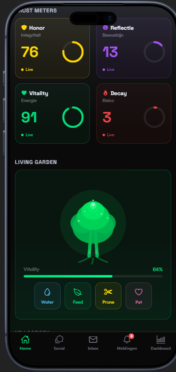

# Lumia 2026 — Elite Trust Platform

<p align="center">
  
</p>

Een mobiele app gebouwd met Expo React Native die vertrouwen meet en visualiseert via 4 Trust Meters.

## Over de app

Lumia 2026 is een Elite Trust Platform waarbij gebruikers hun betrouwbaarheid opbouwen via vier dimensies:

- **Honor** — Eerlijkheid en integriteit
- **Reflectie** — Zelfbewustzijn en groei
- **Vitality** — Energie en betrokkenheid
- **Decay** — Afname bij inactiviteit

## Features

- 4 Trust Meters met live XP-systeem
- Living Garden (visuele representatie van trust score)
- Statement voting met Trust-Gravity algoritme
- XP Gifting in chat
- Notificaties
- Onboarding flow
- Admin Dashboard met database status
- Vrienden & berichten systeem
- Info schermen (Help, Privacy, Voorwaarden, Over, Instellingen)

## Tech Stack

- **Frontend**: Expo React Native (iOS, Android, Web)
- **Backend**: Node.js + Express API server
- **Database**: PostgreSQL via Insforge SDK
- **Design**: Glassmorphism, Space Grotesk + Outfit fonts, #0a0a0a achtergrond

## Starten

```bash
pnpm install
pnpm --filter @workspace/api-server run dev
pnpm --filter @workspace/lumia run dev
```

## Omgevingsvariabelen

Vereiste secrets:
- `INSFORGE_API_KEY` — Insforge database toegang
- `INSFORGE_URL` — Insforge API endpoint
- `SESSION_SECRET` — Express sessie beveiliging
